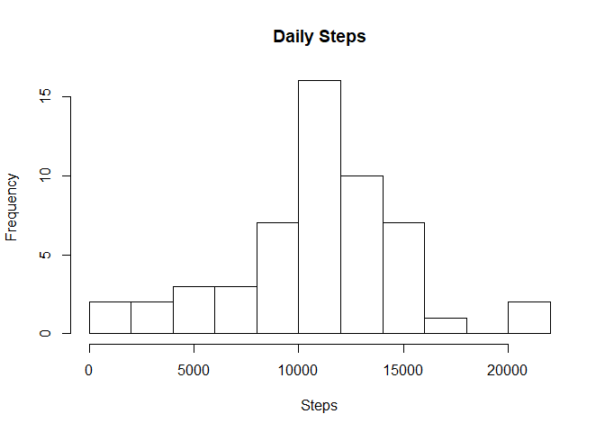
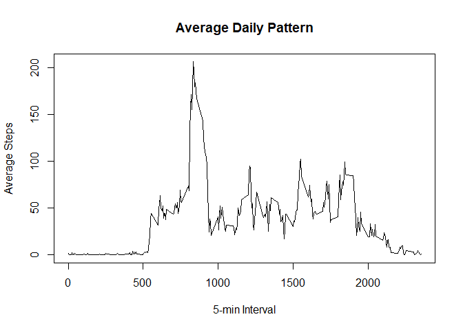
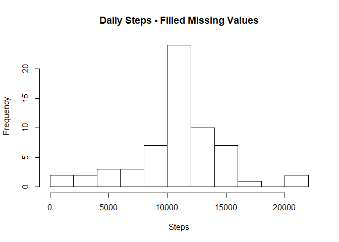

## Loading and preprocessing the data

Loading the data from the zip. 

```r
activity <- read.csv(unzip("activity.zip"))
activity$date <- as.Date(activity$date)
```
Preprocessing date field into a date object

```r
activity$date <- as.Date(activity$date)
```


## What is mean total number of steps taken per day?

```r
stepsPerDay <- aggregate(steps ~ date, activity, sum)
meanStepsPerDay <- round(mean(stepsPerDay$steps),2)
medianStepsPerDay <- median(stepsPerDay$steps)
```

* The **mean** total number of steps taken per day is 
    **10766.19** steps.
* The **median** total number of steps taken per day is 
    **10765** steps.


```r
hist(stepsPerDay$steps, main = "Daily Steps", xlab = "Steps", breaks = 8)
```

<!-- -->


## What is the average daily activity pattern?
The time series plot (i.e. type = "l") of the 5-minute interval (x-axis) and the average number of steps taken, averaged across all days (y-axis):

```r
stepsByInterval<-aggregate(steps~interval,data=activity,mean)
plot(steps~interval, stepsByInterval, type="l", main = "Average Daily Pattern", xlab = "5-min Interval", ylab = "Average Steps")
```

<!-- -->

Which 5-minute interval, on average across all the days in the dataset, contains the maximum number of steps?

```r
maxInterval <- stepsByInterval[which.max(stepsByInterval$steps),]$interval
```
* The **835th** interval contains the
    maximum number of steps.
    
## Imputing missing values
Calculate and report the total number of missing values in the dataset:

```r
countNA <- sum(is.na(activity$steps))
```
* There are **2304** total number of missing values in the dataset.

Fill missing data in with the mean for that 5-minute interval:

```r
library(dplyr)
activityUpdated <- left_join(activity, stepsByInterval, by = "interval") %>%
mutate(steps = ifelse(is.na(steps.x), steps.y, steps.x)) %>%
select (-steps.x, -steps.y)
```

## What is the *new* mean total number of steps taken per day?

```r
stepsPerDayUpdated <- aggregate(steps ~ date, activityUpdated, sum)
meanStepsPerDayUpdated <- round(mean(stepsPerDayUpdated$steps),2)
medianStepsPerDayUpdated <- median(stepsPerDayUpdated$steps)
```

* The **mean** total number of steps taken per day is 
    **10766.19** steps.
* The **median** total number of steps taken per day is 
    **10766.19** steps.


```r
hist(stepsPerDayUpdated$steps, main = "Daily Steps - Filled Missing Values", xlab = "Steps", breaks = 8)
```

<!-- -->


## Are there differences in activity patterns between weekdays and weekends?

First, we need to know which days are weekends versus weekdays:

```r
activityUpdated$day <- ifelse(weekdays(activityUpdated$date) %in% c("Saturday", "Sunday"), "weekend", "weekday")
activityUpdated$day <- as.factor(activityUpdated$day)
activityWeekend <- activityUpdated[activityUpdated$day %in% "weekend",]
activityWeekday <- activityUpdated[activityUpdated$day %in% "weekday",]
```
Then, we will get the mean for each 5-minute interval for the weekend and then for the weekday:

```r
stepsByIntervalWeekday<-aggregate(steps~interval,data=activityWeekday,mean)
stepsByIntervalWeekend<-aggregate(steps~interval,data=activityWeekend,mean)
stepsByIntervalWeekday$day <- as.factor("weekday")
stepsByIntervalWeekend$day <- as.factor("weekend")
```
Finally, we will combine the two data sets and then plot them for comparison:

```r
library(lattice)
stepsIntervalComparison <- rbind(stepsByIntervalWeekday, stepsByIntervalWeekend)
xyplot(steps ~ interval | day, data=stepsIntervalComparison, type = "l", layout = c(1,2))
```

<!-- -->

There is an obvious difference between weekend and weekday activity:

* Weekdays start a little earlier
* Activity increases quickly on the weekedays, with a more gradual build for weekends
* General activity is greater over the entire day on weekends

